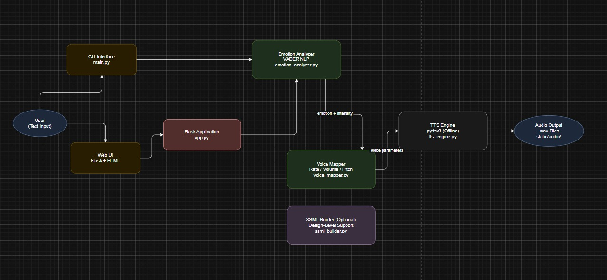

# The Empathy Engine  
**Emotion-Aware Text-to-Speech System**

---

## Project Overview

The **Empathy Engine** is an emotion-aware Text-to-Speech (TTS) system designed to make AI-generated voices sound more human, expressive, and context-aware.

While traditional TTS systems can accurately convert text into speech, they often sound robotic and emotionally flat. This project bridges that gap by detecting the emotional tone of input text and dynamically modulating vocal characteristics such as speech rate, volume, and pitch.

Based on the input text, the system adapts its vocal delivery to sound:

- Enthusiastic for positive or exciting messages  
- Calm and neutral for informational responses  
- Slower and softer for frustrated or negative contexts  
- Curious for inquisitive inputs  

The entire system is offline, lightweight, explainable, and free to run locally.

---

## Key Features

- Lightweight emotion detection using NLP  
- Support for granular emotions:
  - Neutral  
  - Positive  
  - Negative  
  - Enthusiastic  
  - Frustrated  
  - Inquisitive  
- Emotion intensity scaling (stronger emotion results in stronger voice modulation)  
- Dynamic control of:
  - Speech rate  
  - Speech volume  
  - Speech pitch (best-effort, platform-dependent)  
- Generates playable `.wav` audio files  
- Web interface with instant audio playback  
- CLI mode for quick testing  
- Fully offline and free  

---

## High-Level System Flow

Text Input
↓
Emotion Detection + Intensity
↓
Emotion to Voice Parameter Mapping
↓
Text-to-Speech Engine
↓
Emotion-Aware Audio Output

---

### Architecture Diagram

The diagram below illustrates the complete architecture of the Empathy Engine and the flow of data through the system.

## Architecture Overview

The Empathy Engine follows a modular and explainable architecture:

- Supports both CLI and Web UI inputs  
- Flask acts as a lightweight orchestration layer  
- Clear separation of responsibilities between:
  - Emotion detection  
  - Voice parameter mapping  
  - Speech synthesis  
- Fully offline TTS generation  
- SSML support designed as an optional future enhancement without affecting system stability  

---

## Tech Stack

- **Language:** Python 3.11  
- **Emotion Analysis:** VADER Sentiment Analyzer  
- **Text-to-Speech:** pyttsx3 (offline)  
- **Web Framework:** Flask  
- **Frontend:** HTML (Jinja2 templates)  

All tools were chosen to keep the system:

- Free  
- Offline  
- Explainable  
- Easy to run on standard laptops  

---

## How to Download and Run the Project

### Clone the Repository

git clone https://github.com/ppspoornesh/empathy-engine.git
cd empathy-engine
---

## High-Level System Flow

- Create and Activate a Virtual Environment (Windows)
- python -m venv venv
- venv\Scripts\activate

- Install Dependencies
- pip install -r requirements.txt

- Required libraries:

- vaderSentiment

- pyttsx3

- flask

- Running the Application
- Option 1: CLI Mode
- python main.py

- Enter text when prompted

- An emotion-aware .wav file is generated and saved locally

- Option 2: Web Interface (Recommended)
- python app.py

- Open a browser and navigate to:

- http://127.0.0.1:5000

- From the web interface, you can:

- Enter text

- View detected emotion and intensity

- Play generated audio directly in the browser

## Emotion Detection Logic

Emotion detection uses a hybrid, explainable approach:

- VADER sentiment compound score in the range −1 to +1  
- Rule-based heuristics for clarity and transparency  

### Example Rules

- Strong positive sentiment or an exclamation mark indicates enthusiasm  
- Strong negative sentiment indicates frustration  
- Presence of a question mark indicates inquisitiveness  
- Otherwise, the emotion is classified as positive, negative, or neutral  

This approach keeps the system lightweight, transparent, and easy to debug.

---

## Emotion-to-Voice Mapping Strategy

### Baseline Voice Parameters

- **Rate:** 150  
- **Volume:** 0.9  
- **Pitch:** 50  

### Modulation Behavior

**Positive / Enthusiastic**
- Faster speech  
- Slightly louder volume  
- Higher pitch  

**Negative / Frustrated**
- Slower speech  
- Softer volume  
- Lower pitch  

**Inquisitive**
- Slightly faster rate  
- Neutral volume  
- Slight pitch increase  

**Neutral**
- Baseline parameters  

Emotion intensity determines how strongly these parameters are adjusted.

---

## Web Interface

The Flask-based web interface provides:

- Browser-based text input  
- Real-time emotion detection  
- Audio generation and playback  
- Support for multiple requests without overwriting files  

## SSML (Design-Level Support)

The project includes a design-level SSML builder to demonstrate how emotion-aware SSML markup such as prosody, pauses, and pitch could be generated.

Due to limited SSML support in `pyttsx3` on Windows, SSML execution is not enabled by default.  
The architecture allows easy migration to SSML-capable TTS engines in the future without changes to core logic.

---

## Testing

Manual test cases were used to validate:

- Emotion classification  
- Intensity scaling  
- Voice parameter modulation  
- Audio generation  
- Web interface behavior  

### Sample Inputs

- This is AMAZING news  
- Why is this taking so long  
- I am disappointed with the service  
- Your request has been processed  

---

## Limitations

- Pitch control is best-effort and may not be supported on all platforms  
- Rule-based emotion detection may miss sarcasm or complex emotions  
- Audio quality depends on the system’s installed TTS voice  

---

## Future Improvements

- Full SSML execution using advanced TTS engines  
- Transformer-based emotion classification  
- Multi-language support  
- Voice consistency across longer conversations  

---

## Conclusion

The Empathy Engine demonstrates how emotion-aware voice interaction can be built using lightweight, explainable components.  
The project prioritizes clarity, stability, and practical engineering decisions, making it suitable for real-world AI-driven customer interaction systems.

